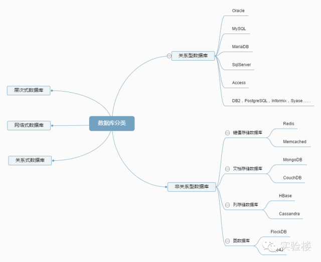

# sql基础(Structured Query Language)

## 基本概念

### 1. 数据库和数据库管理系统

数据库(Database): 是将大量数据保存起来，通过计算机加工而成的可以进行高效访问的**数据集合**。

DBMS (Database Management System):用来管理数据库的计算机系统称为数据库管理系统（DBMS）。

### 2. 数据库的种类



### 3. Database和DBMS的作用

1. Database的作用

    * 实现数据共享
    * 减少数据的冗余度
    * 数据的独立性
    * 数据实现集中控制
    * 数据一致性和可维护性，以确保数据的安全性和可靠性
    * 故障恢复

2. DBMS的作用

    * **数据定义**：DBMS提供数据定义语言DDL（Data Definition Language），,供用户定义数据库的三级模式结构、两级映像以及完整性约束和保密限制等约束。DDL主要用于建立、修改数据库的库结构。DDL所描述的库结构仅仅给出了数据库的框架，数据库的框架信息被存放在数据字典（Data Dictionary）中。

    * **数据操作**：DBMS提供数据操作语言DML（Data Manipulation Language），供用户实现对数据的追加、删除、更新、查询等操作。
    * **数据库的运行管理**：数据库的运行管理功能是DBMS的运行控制、管理功能，包括多用户环境下的并发控制、安全性检查和存取限制控制、完整性检查和执行、运行日志的组织管理、事务的管理和自动恢复，即保证事务的原子性。这些功能保证了数据库系统的正常运行。
    * **数据组织、存储与管理**：DBMS要分类组织、存储和管理各种数据，包括数据字典、用户数据、存取路径等，需确定以何种文件结构和存取方式在存储级上组织这些数据，如何实现数据之间的联系。数据组织和存储的基本目标是提高存储空间利用率，选择合适的存取方法提高存取效率。
    * **数据库的保护**：数据库中的数据是信息社会的战略资源，所以数据的保护至关重要。DBMS对数据库的保护通过4个方面来实现：数据库的恢复、数据库的并发控制、数据库的完整性控制、数据库安全性控制。DBMS的其他保护功能还有系统缓冲区的管理以及数据存储的某些自适应调节机制等。
    * **数据库的维护**：这一部分包括数据库的数据载入、转换、转储、数据库的重组合重构以及性能监控等功能，这些功能分别由各个使用程序来完成。
    * **通信**：DBMS具有与操作系统的联机处理、分时系统及远程作业输入的相关接口，负责处理数据的传送。对网络环境下的数据库系统，还应该包括DBMS与网络中其他软件系统的通信功能以及数据库之间的互操作功能。

3. 数据模型

    * 对象模型
    * 层次模型（轻量级数据访问协议）
    * 网状模型（大型数据储存）
    * 关系模型
    * 面向对象模型
    * 半结构化模型
    * 平面模型（表格模型，一般在形式上是一个二维数组。如表格模型数据Excel)

### 4. SQL概要

1. sql语句的种类(根据操作目的划分)

    * DDL(Data Definition Language):用来创建或者删除存储 数据用的数据库以及数据库中的表等对象。
      * CREATE:创建数据库和表等对象。
      * DROP:删除数据库和表等对象。
      * ALTER:修改数据库和表等对象的结构。

    * DML(Data Manipulation Language):查询或者变更表中的记录.
      * SELETE
      * INSERT
      * UPDATE
      * DELETE

    * DCL(Data Control Language):用来确认或者取消对数据库中的数据进行的变更。（事务控制）
      * COMMIT
      * ROLLBACK
      * GRANT
      * REVOKE

2. sql的基本书写规则
    * 以;(分号)结尾
    * 关键字不区分大小写。（推荐关键字大写）
    * 常数的书写
      * 日期和字符：用单引号括起来。
      * 数字直接书写

### 5. 创建数据库和表

1. 创建数据库
  `CREATE DATABASE <库名>;`

2. 创建表
    ```sql
          CREATE TABLE <表名>(
            <列名1><数据类型1>[列约束],
            <列名2><数据类型2>[列约束],
            ...
            [表约束1],[表约束2],...
          );
    ```
3. 命名规则
    * 只能使用半角英文字母、数字、下划线(_)作为数据库、表和列的名称。
    * 名称必须以半角英文字母作为开头。
    * 名称不能重复。

4. 常用数据类型:Integer,Char,Varchar,Date

5. 表操作
    * 删除表
      ```sql
      DROP TABLE <表名>；
      ```
      
    * 表定义更新：添加和删除列
      ```sql
      ALTER TABLE <表名> ADD COLUMN <列名> [列约束];
      ALTER TABLE <表名> DROP COLUMN <列名>;
      ```
    * 插入数据
      ```sql
      INSERT INTO <表名> VALUES (值列表);
      ```
    * 变更表名
     ```sql
      ALTER TABLE <原表名> RENAME TO <新表名>;
      ```

## 查询基础

### 1. SELECT语句基础

  ```sql
  SELECT <列名1>,... FROM <表名>;
  ```
1. 列的查询：
    * clause(子句):上面的语句包含SELECT和FROM两个子句。
    * 查询结果中的列的顺序和SELECT子句中的列顺序相同。
    * SELECT子句中使用*号表示所有列；此时结果中的列的顺序和创建表定义时的顺序相同。

2. 别名
    ```sql
    SELECT <列名1> AS <别名1>[,<列名2> AS <别名2>...] FROM <表名>;
    ```
    * tips:别名中间有空格时，要使用双引号.

3. DISTINCT关键字：去除重复行
    * 使用DISTINCT时,NULL也被视为一类值。
    * DISTINCT只能用在第一个列名前。

4. WHERE子句(根据条件筛选)
    ```sql
    SELECT * FROM <表名> [WHERE <条件表达式>];
    ```
    * SQL语句中的书写顺序(子句顺序)是固定的

5. 注释
    * 单行注释： --
    * 多行注释：/* */
    * 一条SQL语句中也可以插入注释。

### 2. 运算符

1. 算术运行符和比较运行符
    * 比较运算符：=,<>,>,<,>=,<=,IS NULL,IS NOT NULL.比较运算会的结果为逻辑值。
    * 不用记运算符的优先级，多用括号.
    * NULL参与运算:NULL参与算术运算和比较运算结果都为NULL(由于比较运算的结果为逻辑值，比较运算的结果NULL表示UNKONW)。即 (5 > null) is unkown 的值为true;
    * 对于字符串的比较使用字典顺序（ASCII码）进行比较.
    * 判断是否为NULL要用IS NULL和IS NOT NULL，不能用"xxx = NULL"

2. 逻辑运算符（AND,OR,NOT）:连接多个查询条件。
    * 真值(逻辑值):sql中有三种真值。TRUE,FLASE,UNKOWN.
    * 使用集合概念（将表的数据看作集合中的元素）。比较运算就是取某个集合的子集，逻辑运算就是求多个集合的and交集、or并集。not 补集.
    * AND和OR具有短路特性。